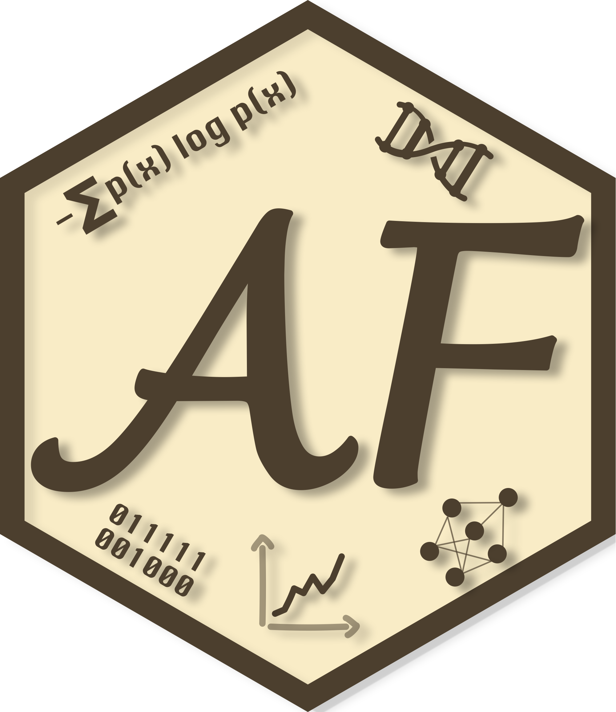

# alfontal.dev 

[](https://app.netlify.com/sites/alfontal/deploys)

Source for [alfontal.dev](https://alfontal.dev), a personal site built with [Astro](https://astro.build/) and a notebook publishing workflow powered by Quarto.

The site mixes a few kinds of content in one static build:

- hand-authored Astro pages for the core site
- data-driven sections for projects, publications, CV, and homepage content
- notebook-based blog posts rendered from `notebooks/`
- Quarto-generated HTML fragments embedded inside the Astro shell

## Repository layout

```text
.
├── notebooks/                # Source notebooks for Quarto-backed posts
├── web/                      # Astro application
│   ├── src/
│   │   ├── pages/            # Routes
│   │   ├── data/             # Structured site content
│   │   ├── content/          # Generated notebook markdown entries
│   │   └── generated/        # Generated Quarto fragments + notebook manifest
│   ├── public/assets/        # Static media, copied notebook assets, CV PDF
│   └── scripts/              # Build helpers, especially notebook rendering
└── .github/workflows/        # Build and deploy automation
```

## How the website works

The Astro app lives in `web/`.

Most of the site is built from normal Astro pages and shared data files:

- `web/src/pages/index.astro`
- `web/src/pages/projects.astro`
- `web/src/pages/publications.astro`
- `web/src/pages/cv.astro`
- `web/src/data/content.ts`

Notebook posts take a different path:

1. Source notebooks live under `notebooks/<section>/<name>.ipynb`.
2. `web/scripts/render-notebooks.mjs` reads the first markdown cell and extracts YAML front matter.
3. Quarto renders each notebook twice:
   - once to `gfm` for a generated Astro content entry
   - once to `html` for a Quarto-authored body fragment
4. Companion assets are copied into `web/public/assets/notebooks/...`.
5. The generated notebook route is rendered through Astro at `/posts/<section>/<name>`.

That setup keeps the website visually consistent while preserving Quarto features such as code formatting, richer notebook structure, and notebook-local assets.

## Requirements

To build the site locally you need:

- Node.js 20+
- npm
- [Quarto](https://quarto.org/)

Quarto is required because notebook posts are rendered during both local development and production builds.

## Local development

Install dependencies:

```bash
cd web
npm install
```

Start the site:

```bash
npm run dev
```

That command automatically regenerates notebook-derived content first through the `predev` hook.

If you are actively editing notebooks and want the notebook pipeline to rerun automatically, use:

```bash
cd web
npm run dev:notebooks
```

This starts Astro and a watcher that reruns the notebook renderer whenever files under `notebooks/` change.

## Build and preview

Create a production build:

```bash
cd web
npm run build
```

The output is written to:

```text
web/dist
```

Preview the production build locally:

```bash
cd web
npm run preview
```

## Content workflow

### Standard site content

The core pages are edited directly in Astro or in the shared content file:

- page structure and layout in `web/src/pages/`
- reusable site copy/data in `web/src/data/content.ts`

### Quarto notebook posts

Each notebook post should live in its own folder under `notebooks/`, for example:

```text
notebooks/world-population/world_pop_densities.ipynb
```

The first markdown cell must contain YAML front matter. The renderer expects:

- `title`
- `description`
- `date`
- `categories`
- `author`
- `image`

Example:

```yaml
---
title: Mapping world population density
description: Global population density maps built with xarray and plotnine.
date: 2025-11-04
categories:
  - Data Visualization
  - Python
author: Alejandro Fontal
image: featured_map.png
---
```

Then regenerate the notebook content:

```bash
cd web
npm run notebooks:render
```

The renderer will:

- validate the notebook front matter
- create generated Astro content in `web/src/content/notebooks-generated/`
- extract Quarto HTML fragments into `web/src/generated/quarto-fragments/`
- copy notebook-local assets into `web/public/assets/notebooks/`
- update `web/src/generated/notebooks-manifest.json`

### Astro-written blog posts

Not every post has to come from a notebook.

For a fully hand-written page, add a normal Astro route under:

```text
web/src/pages/blog/
```

## Deployment

Deployment is currently handled by GitHub Actions and GitHub Pages.

There are two workflows:

- `.github/workflows/web-build.yml`
  - runs on pushes to `main` and on pull requests
  - installs Node and Quarto
  - builds the Astro site
  - uploads `web/dist` as an artifact

- `.github/workflows/web-deploy.yml`
  - runs on pushes to `main`
  - also supports manual runs through `workflow_dispatch`
  - installs Node and Quarto
  - builds the Astro site
  - uploads `web/dist` as a GitHub Pages artifact
  - deploys that artifact through the native GitHub Pages Actions flow

The production site is therefore deployed directly from GitHub Actions to GitHub Pages. The source of truth stays in `main`; there is no separate published branch in the repository workflow anymore.

The repo also includes:

- `web/public/CNAME` so the build declares `alfontal.dev` as the custom domain
- `web/public/.nojekyll` so GitHub Pages serves the static output as-is

If you want to deploy manually, the essential command is still:

```bash
cd web
npm run build
```

Anything that serves the generated `web/dist` directory can host the site.

For GitHub Pages specifically, the repository should be configured in:

- GitHub repository settings
- `Pages`
- `Build and deployment`
- `Source: GitHub Actions`

## Checks

The lightweight content check is:

```bash
cd web
npm run check
```

This verifies that the main Astro pages still import content from the intended shared source.

## In practice

The day-to-day publishing model is:

1. Edit the Astro pages and shared content for the main site.
2. Write notebook-backed posts in `notebooks/`.
3. Run `npm run dev:notebooks` while working.
4. Build with `npm run build`.
5. Push to `main` to trigger the deploy workflow.

That gives one static website with one deployment pipeline, even though some posts originate in Quarto notebooks.
