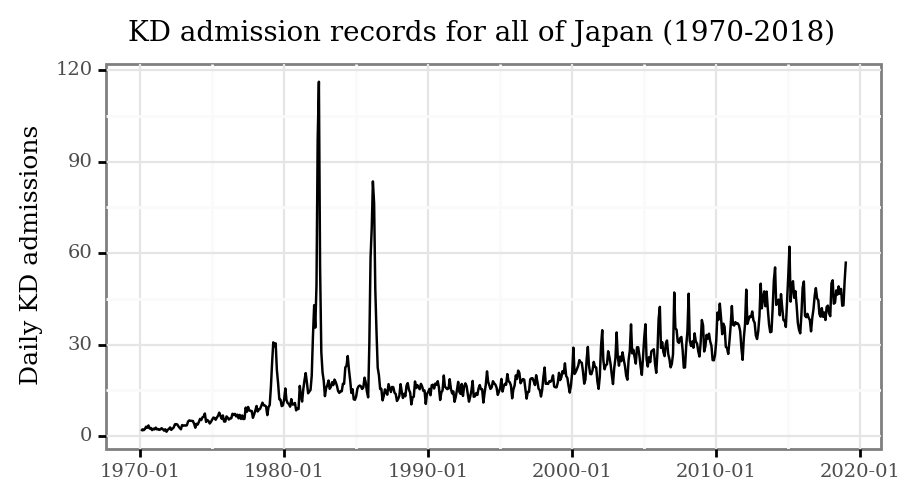
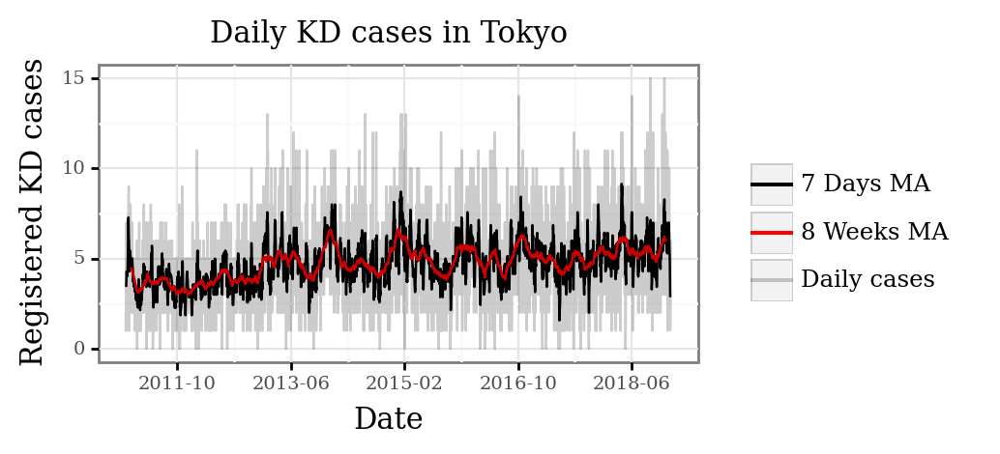
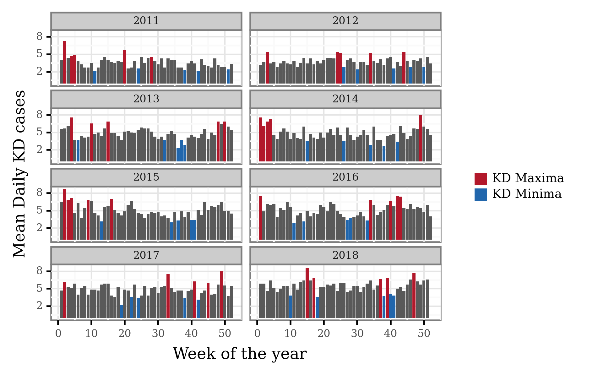
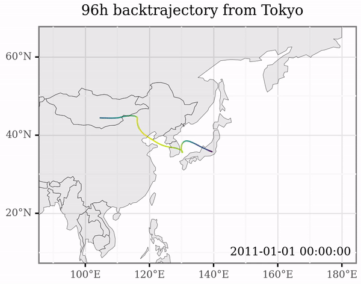
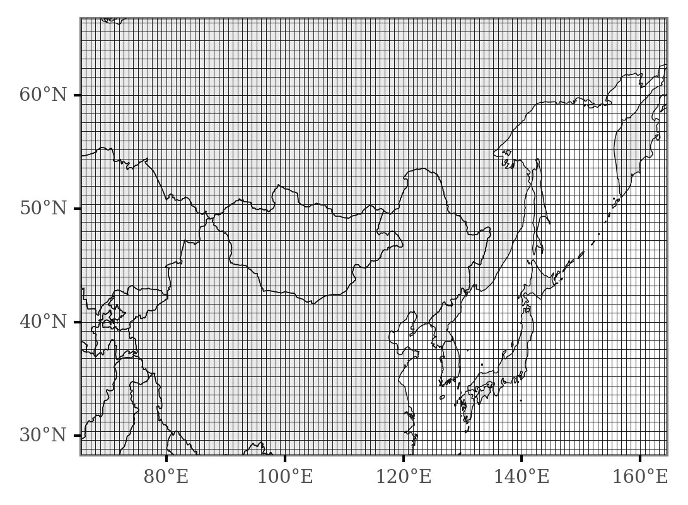
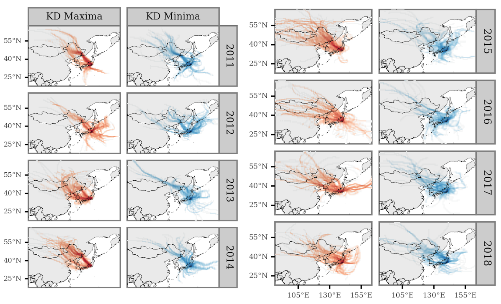
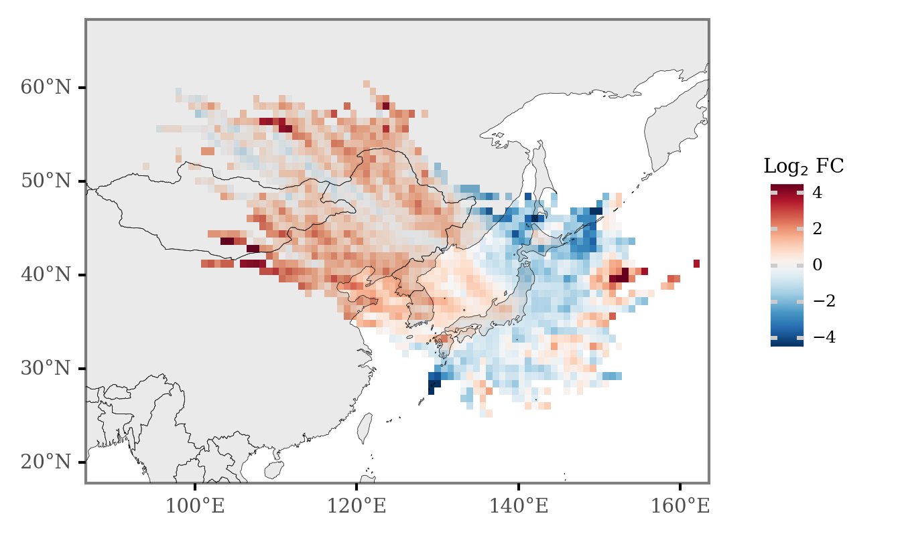

This document intends to expand, provide context and reproducible analysis code on the study presented in a [poster](https://github.com/helical-itn/anca2022-posters/raw/main/posters/ESR6.%20Alejandro%20Fontal/alejandro_poster_vasculitis_2022.pdf) for the [20th International Vasculitis and ANCA Workshop](https://vasculitis2022.org/), which takes place in Dublin, Ireland, from the 3rd to the 6th of April 2022.

The original code and analysis notebook is available in the [source repository](https://github.com/AlFontal/vasculitis2022-conference).


## Table of contents

+ [Background](#background)
+ [Methods](#methods)
+ [Results](#results)
+ [Limitations](#limitations)
+ [Conclusions](#conclusions-and-outlook)
+ [References](#references)
+ [Leave a comment!](#comments)


## Background

**Kawasaki Disease (KD)** is a systemic vasculitis that mainly affects children **younger than 5 years old**. Although KD cases have been registered in over 60 countries across several continents, its incidence is **highest in East Easia**, particularly in **Japan**, where the highest annual incidence rate was recorded in 2018: **359 per 100 000 children aged 0-4 years** [@AE202023]. After more than five decades since its discovery and active research, the etiology of KD is **yet to be elucidated**. Recent studies have analyzed the association between KD and diverse environmental factors, with some advances pointing towards a **relevant role of the atmospheric transport of a wind-borne agent triggering the disease** [@rodo_association_2011; @rodo_tropospheric_2014]. The specific nature of this agent(s) is still unknown, with biological (bacterial, fungal or viral) and chemical (pollution) elements being the strongest candidates to initiate the autoimmune cascade which leads to the disease.

One of the most striking features of the epidemiological dynamics of Kawasaki Disease is the defined **seasonal structure** across multiple countries, with broad coherence in fluctuations of cases across the Northern Hemisphere extra-tropical latitudes [@burns_seasonality_2013].        

In the case of Japan, the number of admissions has been recorded in the epidemiological records since 1970, and show the following pattern:



Three main features are notable:

+ The epidemic peaks of **1979**, **1982** and **1986** (and to a lesser degree, **1984**).
+ The **increasing trend** starting around **1995** until today.
+ The marked **seasonality** from **2000** onwards.

All of this prompts several questions towards the nature of the drivers of these changes in incidence for a disease that is non-communicable in nature.

In this work, we focus on the period from **2011 to 2018** for the prefecture of **Tokyo**, and try to associate the **seasonal maxima** and **minima** to **atmospheric transport patterns**.

## Methods


### Kawasaki Disease

#### Source

We collected data on **date of admission** and **reported date of symptoms onset** for a total of **13970 KD cases** in hospitals belonging to the **Tokyo** prefecture from **2011** to **2018**. This data was originally collected by the (22nd to 25th) nationwide epidemiological surveys of Kawasaki disease in Japan [@makino2015descriptive; @makino2018epidemiological; @makino2019nationwide; @AE202023]. 

```python
kd_japan = (pd.read_csv('../data/kawasaki_disease/japan_ts.csv', index_col=0)
            .reset_index()
            .rename(columns={'index': 'date'})
            .assign(date=lambda dd: pd.to_datetime(dd.date))
)
```

#### Computation of KD maxima and minima

The data was aggregated to generate **daily counts** of hospital admissions and **registered onsets**. 

```python
kd_tokyo = pd.read_csv('../data/kawasaki_disease/tokyo_ts.csv')

(kd_tokyo
 .assign(rolling_7=lambda dd: dd.cases.rolling(7, center=True).mean())
 .assign(rolling_56=lambda dd: dd.cases.rolling(7 * 8, center=True).mean())
 .rename(columns={'cases': 'Daily cases',
                  'rolling_7': '7 Days MA',
                  'rolling_56': '8 Weeks MA'})
 .melt(['date', 'year'])
 .dropna()
 .pipe(lambda dd: p9.ggplot(dd)
       + p9.aes('date', 'value', color='variable', group='variable')
       + p9.geom_line(p9.aes(alpha='variable'))
       + p9.scale_alpha_manual([1, 1, .2])
       + p9.scale_color_manual(['black', 'red', 'black'])
       + p9.scale_x_datetime(labels=date_format('%Y-%m'),
                             breaks=date_breaks('20 months'))
       + p9.theme(figure_size=(4, 2), title=p9.element_text(size=11))
       + p9.labs(x='', y='Registered KD cases',
                 title='Daily KD cases in Tokyo', color='', alpha=''))
)
```



The daily counts were then aggregated by week to obtain a weekly estimate of **case onsets per day** (that is, the daily average for each consecutive week in a year).  

```python
kd_weekly_tokyo = (kd_tokyo
    .assign(date=lambda dd: pd.to_datetime(dd.date))
    .assign(week=lambda dd: (((dd.date.dt.dayofyear - 1) // 7) + 1).clip(None, 52))
    .groupby(['year', 'week'], as_index=False)
    .cases.mean()
)
```

To generate the **yearly maxima** and **minima**, we selected the **5 weeks** with the **most daily cases** and the **5 weeks** with the **least daily cases** for **each year**, respectively, and are shown in the following figure:

```python
kd_weekly_tokyo_minmax = (kd_weekly_tokyo
 .groupby(['year'])
 .apply(lambda dd: pd.concat([
     dd.sort_values('cases').iloc[:5].assign(label='KD Minima'),
     dd.sort_values('cases').iloc[-5:].assign(label='KD Maxima')
 ]))
 .reset_index(drop=True)
)

min_max_weekly_dates = (kd_weekly_tokyo_minmax
 .merge((pd.DataFrame(dict(date=pd.date_range('2011', '2018-12-31')))
         .assign(year=lambda dd: dd.date.dt.year)
         .assign(week=lambda dd: (((dd.date.dt.dayofyear - 1) // 7) + 1)
         .clip(None, 52))))
 .drop(columns='cases')
)

```




### Trajectory Generation

To model **air mass back-trajectories**, we used the Hybrid Single Particle Lagrangian Integrated Trajectory (**HYSPLIT**) model version 5.2 [@stein_noaas_2015], which we operated programmatically via the Python package `PySPLIT` [@warner_introduction_2018] to generate a high amount of trajectories. 

For each day of the period from the 1st of January 2011 to the 31st of December 2018, we generated 4 backtrajectories up to the previous 96h starting at 00:00, 6:00, 12:00 and 18:00, with the initial point 10 meters over sea surface in central Tokyo (139.65E, 35.68N). 

```python
HYSPLIT_DIR = '/home/afontal/utils/hysplit/exec/hyts_std'
HYSPLIT_WORKING = '/home/afontal/utils/hysplit/working'
METEO_DIR = '/home/afontal/utils/hysplit/meteo/gdas1'
OUT_DIR = '/home/afontal/projects/vasculitis2022-conference/output/trajectories'

for year, month in product(range(2011, 2019), range(1, 13)):
    pysplit.generate_bulktraj('tokyo',
                              hysplit_working=HYSPLIT_WORKING,
                              hysplit=HYSPLIT_DIR,
                              output_dir=OUT_DIR,
                              meteo_dir=METEO_DIR,
                              years=[year],
                              months=[month],
                              meteoyr_2digits=True,
                              hours=[0, 6, 12, 18],
                              altitudes=[10],
                              coordinates=(35.68, 139.65),
                              run=-96,
                              meteo_bookends=([4, 5], []))
```

Below, an extract showing the individual trajectories generated at different points in time:




#### Meteorology data

To model the air trajectories, HYSPLIT requires a set of gridded meteorological data at all pressure levels. In this case, we downloaded the  [GDAS](https://www.ready.noaa.gov/archives.php) 1x1°, 3 hour resolution dataset for every week from December 2010 (to be able to generate backtrajectories starting on January 2011) to December 2018. These data can directly be accessed through [NOAA'S ARL FTP Server](https://www.ready.noaa.gov/archives.php).


### Differential Trajectory Analysis

As a first step, we generated a grid of frequency of intersection between lat-lon grid cells and the trajectories associated to KD maxima and KD minima dates, which are a total of **1120** trajectories associated to each group. 

```python
all_trajs = pysplit.make_trajectorygroup(glob('../output/trajectories/*'))

all_trajectories_data = (
    pd.concat([t.data.assign(traj_id=i) for i, t in enumerate(all_trajs)])
    .drop(columns=['Temperature_C', 'Temperature', 'Mixing_Depth'])
    .assign(start_time=lambda dd: dd.DateTime - pd.to_timedelta(dd.Timestep, unit='h'))
)

trajectory_lines = (
    all_trajectories_data
    .groupby(['traj_id', 'start_time'], as_index=False)['geometry']
    .apply(lambda x: LineString([(i.x, i.y) for i in x.to_list()]))
)
```


We first generate a grid of 200 by 200 cells based on the boundaries of the generated trajectories, which ends up looking like a 0.8x0.8° resolution grid like the one displayed in the following image:

```python
margin = 1
xmin, ymin, xmax, ymax = all_trajectories_data.total_bounds.round() + [200, -margin, 0, margin]
n_cells = 200
cell_size = (xmax - xmin) / n_cells
grid_cells = []

for x0 in np.arange(xmin, xmax + cell_size, cell_size):
    for y0 in np.arange(ymin, ymax + cell_size, cell_size):
        x1 = x0 - cell_size
        y1 = y0 + cell_size
        grid_cells.append(shapely.geometry.box(x0, y0, x1, y1))

grid = (gpd.GeoDataFrame(grid_cells, columns=['geometry'])
        .assign(cell=lambda dd: dd.geometry)
        .assign(x=lambda dd: dd.cell.centroid.x, y=lambda dd: dd.cell.centroid.y))

x_y_poly = grid[['x', 'y', 'cell']].drop_duplicates()
```



Then, we count the number of intersections of the trajectories of each KD group for each of the grid cells, which allows us to visualize longer term or aggregated patterns, like in this figure that displays the different sources associated to KD maxima and minima per calendar year:

```python
min_max_trajectories = (
    trajectory_lines
    .assign(date=lambda dd: pd.to_datetime(dd.start_time.dt.date))
    .merge(min_max_weekly_dates)
)

grid_intersections = gpd.sjoin(min_max_trajectories, grid, op='intersects')
```



By comparing, cell-wise, the ratio between KD maxima and KD minima intersections, we can obtain an overview of the source areas overrepresented in association with the timings of either phenomena. 

To generate a summarized figure, we use the **Log2** transformation of the ratios to generate the image, and colour each cell grid according to this. The transformation defined as:

$$R = \text{Log}_2\cfrac{\text{Intersections}_{max}}{\text{Intersections}_{min}}$$

This allows for a symmetric scale on both sides, generating negative values for areas overrepresented for KD minima, and positive values for areas overrepresented in KD maxima. 

```python
(grid_intersections
 .groupby(['x', 'y', 'label'])
 .size()
 .rename('n')
 .reset_index()
 .pivot(['x', 'y'], 'label', 'n')
 .fillna(0)
 .assign(diff=lambda dd: dd['KD Maxima'] - dd['KD Minima'])
 .assign(fc=lambda dd: np.log2(dd['KD Maxima'] / dd['KD Minima']))
 .sort_values('diff')
 .reset_index()
 .merge(x_y_poly)
 .assign(total_n=lambda dd: dd['KD Maxima'] + dd['KD Minima'])
 .loc[lambda dd: dd.total_n >= 1120 * 0.01]
 .pipe(lambda dd: p9.ggplot(dd)
       + p9.geom_map(p9.aes(fill='fc', geometry='cell'), size=.0)
       + p9.geom_map(data=world, size=.1, alpha=.1)
       + p9.scale_fill_continuous('RdBu_r')
       + p9.scale_alpha_continuous(trans='log10')
       + p9.theme(dpi=300, panel_grid=p9.element_blank(),
                  plot_background=p9.element_blank(),
                  legend_background=p9.element_blank(),
                  legend_key_size=8,
                  legend_text=p9.element_text(size=6),
                  legend_title_align='center',
                  legend_title=p9.element_text(size=7))
       + p9.labs(fill='Log$_2$ FC')
       + p9.scale_x_continuous(labels=custom_format('{:0g}°E'), limits=(90, 160))
       + p9.scale_y_continuous(labels=custom_format('{:0g}°N'), limits=(20, 65)))
)
```

## Results

The main findings support the hypothesis that winds from **Northeastern Asia** are associated and synchronized with **periods of high KD Maxima** in **Tokyo**, as the main figure portrays:



Red values represent those areas of more common occurence during weeks of KD maxima with respect to those of KD minima, with blue values representing the opposite. 

All in all, there seem to be two main different routes associated to periods of 

## Limitations

### Temporal association study

There are several limitations when trying to relate studies to connect temporal changes between different processes, as finding associations doesn't necessarily imply a causal link between both phenomena, and external drivers connecting both might be the reason of the link.

### Choice of temporal variability

Taking this into account, the **temporal changes** in KD incidence in Tokyo has **three main sources of variability**:

+ The increasing trend.
+ The seasonal variation (mainly, of yearly frequence).
+ The anomalies once removed of trend and seasonal variability.

The methods employed here, given the selection of the yearly maxima and minima, only allow us to associate or identify the phenomena related to yearly variation, and would fail to identify the processes that drive the general increase in cases for the last 20 years and the anomalies unrelated to the seasonal variability. 

### Backtrajectory modelling

The use of HYSPLIT for modelling the trajectories implies that there is a certain degree of error in the estimation of the trajectories, and the magnitude of these is known to increase as the trajectories surpass the planet boundary layer. By not using single trajectories to assess any of the effects but aggregates of many of them, we attempted to mitigate these issues. The use of higher resolution meteorology data might also allow us to improve the accuracy of the modelling. 

In this study, we've also just considered the 2D intersections of the trajectories with the latitudinal-longitudinal plane, without regard for the actual altitude of the trajectories. To be more thorough, we should include the altitude of the trajectories in each point in  time, paired with calculations of moisture uptake rates in order to able to actually pinpoint with better accuracy the areas where the air masses that arrive to the destination are _collecting_ matter.

## Conclusions and outlook

This study further confirms, with updated data, the hypothesis connecting the tropospheric winds from NE Asia with higher Kawasaki Disesase incidence periods which was discussed in @rodo_tropospheric_2014, allowing us now to pinpoint with higher accuracy the specific locations that might source the (or one of) the etiologic agents of the disease.

Further studies should (and are being done) on the characterization of these air masses to understand the potential immune-triggering compounds carried in them.

Stay posted for more updated on the issue and feel free to comment below with any doubts or comments.

## References

::: {#refs}
:::