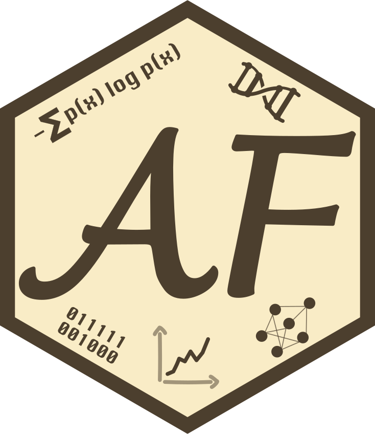

::: {layout="[20, 35, 20]" .profile-text}

{.about-image loading=lazy}

<div class="about-header">
<h1 class="about-title">Alejandro Fontal</h1>
<p class="about-subtitle">
<span class="typed-terminal" role="presentation">
  <span class="terminal-prefix" aria-hidden="true"> ~$ </span>
  <span id="role-rotator" class="typed-role" aria-live="polite">Research Data Scientist</span>
</span>
</p>
<div class="about-links">
<a href=mailto:alejandro.fontal.92@gmail.com> </a> 
<a href=https://github.com/AlFontal></a>
<a href=https://gitlab.com/AlFontal></a>
<a href=https://linkedin.com/in/AlFontal></a>
<a href=https://orcid.org/0000-0003-1138-2158></a>
<a href=https://twitter.com/alefontal></a>
<a href=https://letterboxd.com/AlFontal></a>
<a href=https://www.instagram.com/afontal></a>
<a href=https://www.strava.com/athletes/24896086></a>
</div>
</div>

{.about-logo loading=lazy}

:::

Welcome to my personal site and portfolio. My name is Alejandro and I am a researcher from Barcelona. My area of expertise lies in the application of data science to various fields of scientific research, specifically in the areas of bioinformatics, epidemiology, and computational biomedicine.

```{=html}
<script>
(function () {
  const target = document.getElementById('role-rotator');
  if (!target) return;

  const prefersReducedMotion = window.matchMedia('(prefers-reduced-motion: reduce)').matches;
  const roles = [
    'Researcher',
    'Data Scientist',
    'Bioinformatician',
    'Software Developer',
    'Open Science Advocate',
  ];

  if (prefersReducedMotion || roles.length === 0) {
    target.textContent = roles[0] || target.textContent;
    return;
  }

  let roleIndex = 0;
  let charIndex = 0;
  let isDeleting = false;
  const typingDelay = 110;
  const deletingDelay = 55;
  const holdDelay = 1800;

  function type() {
    const current = roles[roleIndex];

    if (!isDeleting) {
      charIndex += 1;
      target.textContent = current.substring(0, charIndex);
      if (charIndex === current.length) {
        isDeleting = true;
        setTimeout(type, holdDelay);
        return;
      }
    } else {
      charIndex -= 1;
      target.textContent = current.substring(0, charIndex);
      if (charIndex === 0) {
        isDeleting = false;
        roleIndex = (roleIndex + 1) % roles.length;
      }
    }

    const delay = isDeleting ? deletingDelay : typingDelay;
    setTimeout(type, delay);
  }

  type();
})();
</script>
```

```{=html}
<div class="role-overview" data-role-default="">
  <div class="role-pills" role="tablist" aria-label="About overview">
    <button type="button" class="role-pill" role="tab" aria-selected="false" aria-controls="role-current" id="role-pill-current">Current Role</button>
    <button type="button" class="role-pill" role="tab" aria-selected="false" aria-controls="role-background" id="role-pill-background">Background</button>
    <button type="button" class="role-pill" role="tab" aria-selected="false" aria-controls="role-site" id="role-pill-site">This site</button>
  </div>
  <div class="role-panels" hidden aria-hidden="true">
    <section id="role-current" class="role-panel" role="tabpanel" aria-labelledby="role-pill-current" hidden>
      <h3 class="visually-hidden">Current Role</h3>
      <p>Currently, I am a postdoctoral researcher at the Barcelona Institute for Global Health (ISGlobal).</p>
      <p>In my research, I use a combination of time series analysis, GIS, metagenomics sequencing, and epidemiology to study the underlying drivers of diseases burdening public health systems. A big part of my work performed during my PhD and postdoc has focused on Kawasaki Disease, a pediatric syndrome that affects thousands of children each year and whose etiology is still a mystery after more than 50 years of study.</p>
      <p>Apart from this, I also work together with our colleagues in the <a href="https://github.com/AirLabBcn">AIRLAB</a> on the <em>aerobiome</em>, studying the microbial diversity that inhabits the air, both indoors and outdoors (in the urban aerobiome but also in rural areas and up in the atmosphere).</p>
    </section>
    <section id="role-background" class="role-panel" role="tabpanel" aria-labelledby="role-pill-background" hidden>
      <h3 class="visually-hidden">Background</h3>
      <p>I hold a BSc in Molecular Biotechnology from the University of Barcelona, an MSc in Bioinformatics with a specialization in Data Science from Wageningen University &amp; Research, and a PhD in Biotechnology from the University of Barcelona.</p>
      <p>I have previously worked on designing and implementing online courses on the EdX platform for the Educational Staff Development department in WUR, and as a Data Scientist in the R&amp;D department of Dupont Nutrition &amp; Biosciences, where we applied novel machine learning techniques to optimize the protein engineering process.</p>
      <p>For a comprehensive overview of my professional experience you can explore my detailed CV.</p>
    </section>
    <section id="role-site" class="role-panel" role="tabpanel" aria-labelledby="role-pill-site" hidden>
      <h3 class="visually-hidden">This site</h3>
      <p>I built this site with <a href="https://quarto.org">Quarto</a>, an open-source project that lets you create documents, websites, and books using Markdown, R, Python, and HTML.</p>
      <p>I treated it as an opportunity to practice modern web development and experiment with HTML/CSS and a bit of JavaScript. A lot of inspiration came from other Quarto websites:</p>
      <ul>
        <li><a href="https://mickael.canouil.fr/">Mickael Canouil's personal website</a>: I started from his SCSS and index files and worked from there.</li>
        <li>Jeffrey Girard's <a href="https://affcom.ku.edu/">AffComLab website</a>: I adapted his <code>article.ejs</code> script to automatically list publications.</li>
      </ul>
      <p>You can check the source code on <a href="https://github.com/AlFontal">GitHub</a>. Feel free to open an issue if you spot anything broken, as I may have overdone it with the CSS/JavaScript tweaks.</p>
    </section>
  </div>
</div>
```

```{=html}
<script>
document.addEventListener('DOMContentLoaded', function () {
  document.querySelectorAll('.role-overview').forEach(function (block) {
    const pills = Array.from(block.querySelectorAll('.role-pill'));
  const panels = Array.from(block.querySelectorAll('.role-panel'));
  const panelsContainer = block.querySelector('.role-panels');

    if (!pills.length || !panels.length) {
      return;
    }

    let activeId = null;

    const hideAll = function () {
      pills.forEach(function (pill) {
        pill.classList.remove('is-active');
        pill.setAttribute('aria-selected', 'false');
        pill.setAttribute('aria-expanded', 'false');
      });

      panels.forEach(function (panel) {
        panel.hidden = true;
        panel.setAttribute('aria-hidden', 'true');
      });

      activeId = null;

      if (panelsContainer) {
        panelsContainer.hidden = true;
        panelsContainer.setAttribute('aria-hidden', 'true');
      }
    };

    const showPanel = function (targetId) {
      const panel = block.querySelector('#' + CSS.escape(targetId));
      const pill = block.querySelector('[aria-controls="' + CSS.escape(targetId) + '"]');

      if (!panel || !pill) {
        return;
      }

      hideAll();

      pill.classList.add('is-active');
      pill.setAttribute('aria-selected', 'true');
      pill.setAttribute('aria-expanded', 'true');
      panel.hidden = false;
      panel.setAttribute('aria-hidden', 'false');
      activeId = targetId;

      if (panelsContainer) {
        panelsContainer.hidden = false;
        panelsContainer.setAttribute('aria-hidden', 'false');
      }
    };

    const focusByOffset = function (current, offset) {
      const index = pills.indexOf(current);
      if (index === -1) {
        return;
      }
      const nextIndex = (index + offset + pills.length) % pills.length;
      pills[nextIndex].focus();
    };

    hideAll();

    const defaultId = block.getAttribute('data-role-default');
    if (defaultId) {
      showPanel(defaultId);
    }

    pills.forEach(function (pill) {
      pill.addEventListener('click', function () {
        const targetId = pill.getAttribute('aria-controls');
        if (!targetId) {
          return;
        }

        if (activeId === targetId) {
          hideAll();
          return;
        }

        showPanel(targetId);
      });

      pill.addEventListener('keydown', function (event) {
        switch (event.key) {
          case 'ArrowRight':
          case 'ArrowDown':
            event.preventDefault();
            focusByOffset(pill, 1);
            break;
          case 'ArrowLeft':
          case 'ArrowUp':
            event.preventDefault();
            focusByOffset(pill, -1);
            break;
          case 'Home':
            event.preventDefault();
            pills[0].focus();
            break;
          case 'End':
            event.preventDefault();
            pills[pills.length - 1].focus();
            break;
          case 'Enter':
          case ' ':
            event.preventDefault();
            pill.click();
            break;
        }
      });
    });

    document.querySelectorAll('.education-card').forEach(function (card) {
      const toggle = card.querySelector('.education-card__toggle');
      const details = card.querySelector('.education-card__details');

      if (!toggle || !details) {
        return;
      }

      const open = function () {
        details.hidden = false;
        toggle.setAttribute('aria-expanded', 'true');
        card.classList.add('is-open');
      };

      const close = function () {
        details.hidden = true;
        toggle.setAttribute('aria-expanded', 'false');
        card.classList.remove('is-open');
      };

      close();

      toggle.addEventListener('click', function () {
        if (details.hidden) {
          open();
        } else {
          close();
        }
      });

      toggle.addEventListener('keydown', function (event) {
        if (event.key === 'ArrowLeft' || event.key === 'ArrowUp') {
          event.preventDefault();
          const prev = card.previousElementSibling;
          if (prev) {
            const prevToggle = prev.querySelector('.education-card__toggle');
            if (prevToggle) {
              prevToggle.focus();
            }
          }
          return;
        }

        if (event.key === 'ArrowRight' || event.key === 'ArrowDown') {
          event.preventDefault();
          const next = card.nextElementSibling;
          if (next) {
            const nextToggle = next.querySelector('.education-card__toggle');
            if (nextToggle) {
              nextToggle.focus();
            }
          }
          return;
        }

        if (event.key === 'Enter' || event.key === ' ') {
          event.preventDefault();
          toggle.click();
        }
      });
    });
  });
});
</script>
  <noscript>
  <style>
  .role-overview .role-panels[hidden] { display: block !important; }
  .role-overview .role-panel { display: block !important; }
  .role-overview .role-panel[hidden] { display: block !important; }
  </style>
  </noscript>
```

:::: {.grid}

::: {.g-col-12 .g-col-md-8 style="text-align: left;"}
## Education {.index-anchor .index-header}

```{=html}
<div class="education-section" role="list">
  <article class="education-card" role="listitem">
    <button type="button" class="education-card__toggle" aria-expanded="false" aria-controls="education-details-phd" id="education-card-phd">
      <span class="education-card__header">
        <span class="education-card__degree">PhD in Biotechnology</span>
        <span class="education-card__years">2019&#8211;2024</span>
      </span>
      <span class="education-card__meta">ISGlobal & Universitat de Barcelona &middot; Barcelona, ES</span>
    </button>
    <div class="education-card__details" id="education-details-phd" role="region" aria-labelledby="education-card-phd" hidden>
      <p class="education-card__summary">Doctoral research carried out at <a href="https://isglobal.org">ISGlobal</a> within the Climate and Health group at the <a href="https://www.prbb.org/">PRBB</a>, funded by a Marie Skłodowska-Curie Actions grant through the <a href="https://helical-itn.github.io">HELICAL</a> network.</p>
      <p class="education-card__summary">Thesis: <em>Atmospheric characterization and time-series analysis of the impact of environmental factors on disease onset</em>. <a href="https://archive.org/download/thesis_AF_final/thesis_AF_final.pdf">Read the dissertation</a>.</p>
    </div>
  </article>

  <article class="education-card" role="listitem">
    <button type="button" class="education-card__toggle" aria-expanded="false" aria-controls="education-details-msc" id="education-card-msc">
      <span class="education-card__header">
        <span class="education-card__degree">MSc in Bioinformatics</span>
        <span class="education-card__years">2016&#8211;2018</span>
      </span>
      <span class="education-card__meta">Wageningen University &amp; Research &middot; Wageningen, NL</span>
    </button>
    <div class="education-card__details" id="education-details-msc" role="region" aria-labelledby="education-card-msc" hidden>
      <p class="education-card__summary">During my MSc in Bioinformatics at Wageningen University & Research, I explored a wide range of computational biology topics: from R and (especially) Python programming, to systems biology, multiple omics fields, and data science subjects like machine learning, algorithmic development, and the usage of High Performance Computing (HPC).</p>
      <p class="education-card__summary">For my thesis, I developed deep learning models to predict the subcellular localization of proteins, with an emphasis on making these models less of a black box. The thesis can be found <a href="https://edepot.wur.nl/429151">here</a>, and the GitHub repo is available <a href="https://github.com/AlFontal/thesis-protloc">here</a>.</p>
    </div>
  </article>

  <article class="education-card" role="listitem">
    <button type="button" class="education-card__toggle" aria-expanded="false" aria-controls="education-details-bsc" id="education-card-bsc">
      <span class="education-card__header">
        <span class="education-card__degree">BSc in Biotechnology</span>
        <span class="education-card__years">2011&#8211;2015</span>
      </span>
      <span class="education-card__meta">Universitat de Barcelona &middot; Barcelona, ES</span>
    </button>
    <div class="education-card__details" id="education-details-bsc" role="region" aria-labelledby="education-card-bsc" hidden>
      <p class="education-card__summary">I studied Biotechnology at Universitat de Barcelona, where I built a strong base in molecular biology, microbiology, and biochemistry, along with lab experience. By my final year I was already leaning toward the computational side of biology.</p>
      <p class="education-card__summary">My thesis focused on transcriptomics, carrying out a meta-analysis of differential expression methods for microarray data. </p>
    </div>
  </article>
</div>
```
:::

::: {.g-col-12 .g-col-md-4 style="text-align: left;"}
## Interests {.index-anchor .index-header}

```{=html}
<ul class="interest-tags">
  <li class="interest-tag">Automation</li>
  <li class="interest-tag">Open Science</li>
  <li class="interest-tag">Reproducible Research</li>
  <li class="interest-tag">Data Visualisation</li>
  <li class="interest-tag">Machine Learning</li>
  <li class="interest-tag">Epidemiology</li>
  <li class="interest-tag">GIS</li>
</ul>
```
:::

::::


